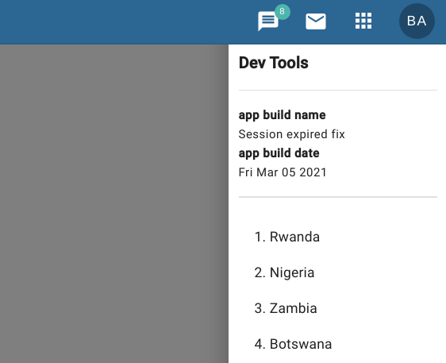

# DHIS2 Dev Tools
**Repo Owner:** Ben Guaraldi [@benguaraldi](https://github.com/benguaraldi)

**What does this library solve?**
1. Did you ever ask QA to test your app but they were testing an old version on another server?
2. Does your QA team find themselves replicating the same scenario in your app over and over?

**Solution for #1**  
If you add `<DevTools>` to your app then your tester can just press `~` on keyboard to open developers only console. There they can double-check build name & date of your app.

**Solution for #2**  
You can automate any task in JavaScript as a function and then inject the function into `<DevTools>`. Your tester can then click a button in `<DevTools>` and save himself a lot of clicking.  
We're using this for pre-filling elaborate search dialogs for each test scenario.



## Usage

You can inject any method. Anything you need to automate in your app. Just wrap it into a method and inject
into `Dev Tools`.

In the below example we want to automate searches by calling `this.search` method with different parameters.

```javascript
import {DevTools, registerDevMethod} from "@pepfar-react-lib/test-console";

export default class SearchForm extends React.Component {
    constructor(props) {
        const searches = [
            {name: '1. Rwanda', method: () => this.search('Rwanda', '2020Q4')},
            {name: '2. Nigeria', method: () => this.search('Nigeria', '2020Q4')},
        ];
        searches.forEach(registerDevMethod);
    }

    search(ou: string, period: string) {
        // your code
    }

    render() {
        return <React.Fragment>
            <MyAwesomeSearchForm onSearch={this.search}/>
            <DevTools buildName={'Dedupe search added'} buildDate={new Date()}/>
        </React.Fragment>
    }
}
```
